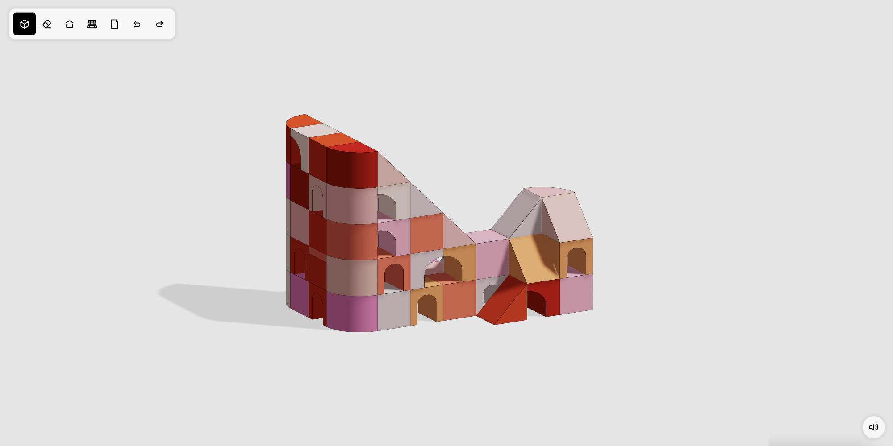

# Block Builder

A small block building browser app.

    

## Running locally

This project was bootstrapped with [Create React App](https://github.com/facebook/create-react-app).

To start this project:
- `npm install`
- `npm start` Runs the app in the development mode.
- Open [http://localhost:3000](http://localhost:3000) to view it in the browser.
